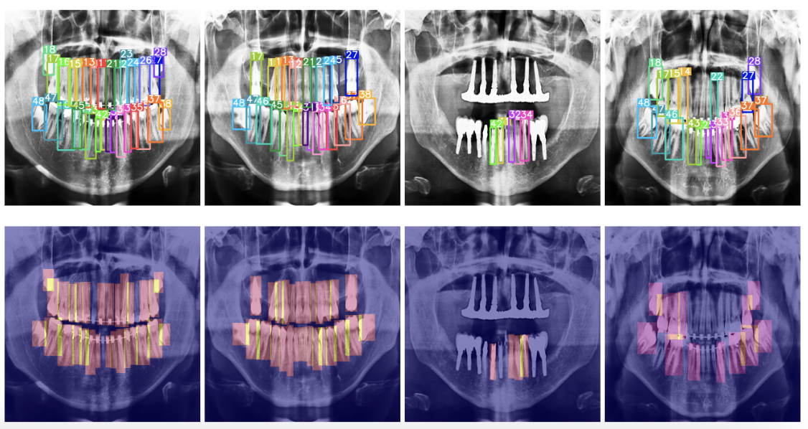
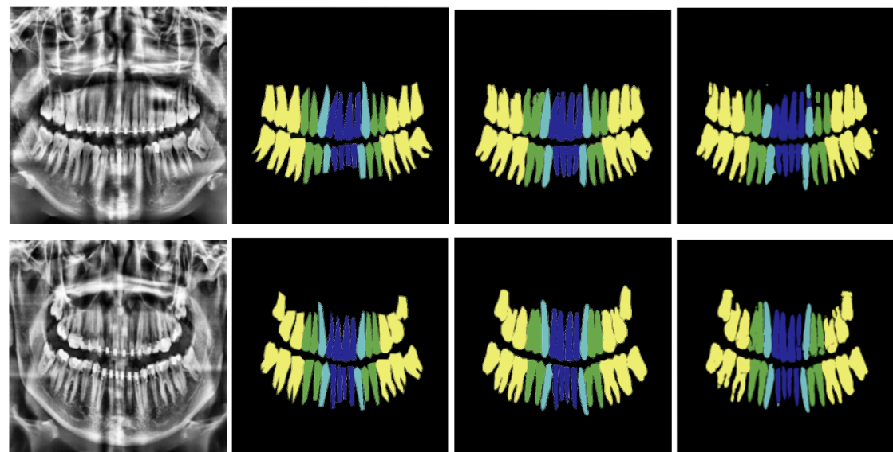

# Repository for UFBA-425 and OralBBNet

This repository contains the implementation related to the pipelines of [UFBA-425](https://figshare.com/articles/dataset/UFBA-425/29827475) dataset amd the paper [OralBBNet: Spatially Guided Dental Segmentation of Panoramic X-Rays with Bounding Box Priors](https://arxiv.org/abs/2406.03747).

- UFBA-425 Dataset used in this study are avaiable at [FigShare](https://figshare.com/articles/dataset/UFBA-425/29827475)

- 🔥 UFBA-425 Dataset featured in Roboflow100-VL Benchmark for the year of 2025 and referred UFBA-425 as one of the hardest datasets for vision tasks. Find the [paper](https://media.roboflow.com/rf100vl/rf100vl.pdf) here.

## Dataset

- We introduce a set of 425 panoramic X-rays with Human annotated Bounding Boxes and Polygons, the 425 images are a subset of UFBA-UESC Dental Dataset. This dataset can be extensively used for detection and segmentation tasks for Dental Panoramic X-rays. Refer to [Description](./Dataset/Dataset_description.pdf) for understanding the organisation of annotations and panoramic X-rays. The Distribution of Categories in the dataset are metnioned in the table below.


<table style="margin-left:auto;margin-right:auto;">
  <thead>
    <tr>
      <th style="text-align:center;">Category</th>
      <th style="text-align:center;">32 Teeth</th>
      <th style="text-align:center;">Restoration</th>
      <th style="text-align:center;">Dental Appliance</th>
      <th style="text-align:center;">Images</th>
      <th style="text-align:center;">Used Images</th>
    </tr>
  </thead>
  <tbody>
    <tr>
      <td style="text-align:center;">1</td>
      <td style="text-align:center;">✓</td>
      <td style="text-align:center;">✓</td>
      <td style="text-align:center;">✓</td>
      <td style="text-align:center;">73</td>
      <td style="text-align:center;">24</td>
    </tr>
    <tr>
      <td style="text-align:center;">2</td>
      <td style="text-align:center;">✓</td>
      <td style="text-align:center;">✓</td>
      <td style="text-align:center;"></td>
      <td style="text-align:center;">220</td>
      <td style="text-align:center;">72</td>
    </tr>
    <tr>
      <td style="text-align:center;">3</td>
      <td style="text-align:center;">✓</td>
      <td style="text-align:center;"></td>
      <td style="text-align:center;"></td>
      <td style="text-align:center;">45</td>
      <td style="text-align:center;">15</td>
    </tr>
    <tr>
      <td style="text-align:center;">4</td>
      <td style="text-align:center;">✓</td>
      <td style="text-align:center;"></td>
      <td style="text-align:center;"></td>
      <td style="text-align:center;">140</td>
      <td style="text-align:center;">32</td>
    </tr>
    <tr>
      <td style="text-align:center;">5</td>
      <td colspan="3" style="text-align:center;">Images containing dental implant</td>
      <td style="text-align:center;">120</td>
      <td style="text-align:center;">37</td>
    </tr>
    <tr>
      <td style="text-align:center;">6</td>
      <td colspan="3" style="text-align:center;">Images containing more than 32 teeth</td>
      <td style="text-align:center;">170</td>
      <td style="text-align:center;">30</td>
    </tr>
    <tr>
      <td style="text-align:center;">7</td>
      <td style="text-align:center;"></td>
      <td style="text-align:center;">✓</td>
      <td style="text-align:center;">✓</td>
      <td style="text-align:center;">115</td>
      <td style="text-align:center;">33</td>
    </tr>
    <tr>
      <td style="text-align:center;">8</td>
      <td style="text-align:center;"></td>
      <td style="text-align:center;">✓</td>
      <td style="text-align:center;"></td>
      <td style="text-align:center;">457</td>
      <td style="text-align:center;">140</td>
    </tr>
    <tr>
      <td style="text-align:center;">9</td>
      <td style="text-align:center;"></td>
      <td style="text-align:center;"></td>
      <td style="text-align:center;">✓</td>
      <td style="text-align:center;">45</td>
      <td style="text-align:center;">7</td>
    </tr>
    <tr>
      <td style="text-align:center;">10</td>
      <td style="text-align:center;"></td>
      <td style="text-align:center;"></td>
      <td style="text-align:center;"></td>
      <td style="text-align:center;">115</td>
      <td style="text-align:center;">35</td>
    </tr>
    <tr>
      <td style="text-align:center;"><strong>Total</strong></td>
      <td style="text-align:center;"></td>
      <td style="text-align:center;"></td>
      <td style="text-align:center;"></td>
      <td style="text-align:center;"><strong>1500</strong></td>
      <td style="text-align:center;"><strong>425</strong></td>
    </tr>
  </tbody>
</table>


## Results

- Teeth Numbering Results 

<table>
  <tr>
    <th>Model Architecture</th>
    <th>mAP</th>
    <th>AP50</th>
  </tr>
  <tr>
    <td>Mask R-CNN</td>
    <td>70.5</td>
    <td>97.2</td>
  </tr>
  <tr>
    <td>PANet</td>
    <td>74.0</td>
    <td>99.7</td>
  </tr>
  <tr>
    <td>HTC</td>
    <td>71.1</td>
    <td>97.3</td>
  </tr>
  <tr>
    <td>ResNeSt</td>
    <td>72.1</td>
    <td>96.8</td>
  </tr>
  <tr>
    <td>YOLOv8</td>
    <td>74.9</td>
    <td>94.6</td>
  </tr>
</table>

- Instance Segmentation Results

<table>
  <tr>
    <th>Model Architecture</th>
    <th>Incisors</th>
    <th>Canines</th>
    <th>Premolars</th>
    <th>Molars</th>
  </tr>
  <tr>
    <td>U-Net</td>
    <td>73.29</td>
    <td>69.92</td>
    <td>67.62</td>
    <td>64.98</td>
  </tr>
  <tr>
    <td>YOLOv8-seg </td>
    <td>82.78</td>
    <td>81.91</td>
    <td>81.89</td>
    <td>81.42</td>
  </tr>
  <tr>
    <td>SAM-2 </td>
    <td>87.12</td>
    <td>86.21</td>
    <td>86.19</td>
    <td>85.69</td>
  </tr>
  <tr>
    <td>OralBBNet</td>
    <td>89.34</td>
    <td>88.40</td>
    <td>88.38</td>
    <td>87.87</td>
  </tr>
</table>

- Refer to the paper for further information on model architectures and datasets used for evaluation.

## Teeth Numbering Heatmaps


## Segmentation Masks



## Code Structure 
```bash

2ddaatagen.ipynb                   => Notebook for generating labels
yolov8_train.ipynb                 => Notebook for training YOLOv8
yolo_test.ipynb                    => Notebook for testing YOLOv8
unet_training.ipynb                => Notebook for training U-Net
unet+cv.ipynb                      => Notebook for training U-Net with cross validation
yolov8+unet_training.ipynb         => Notebook for training OralBBNet
yolov8+unet+cv.ipynb               => Notebook for training OralBBNet with cross validation
```

## Cite Us
If you want to cite the dataset, cite this:
```bibtex
@article{Budagam2025,
author = "Devichand Budagam and Azamat Zhanatuly Imanbayev and Iskander Rafailovich Akhmetov and Aleksandr Sinitca and Sergey Antonov and Dmitrii Kaplun",
title = "{UFBA-425}",
year = "2025",
month = "8",
url = "https://figshare.com/articles/dataset/UFBA-425/29827475",
doi = "10.6084/m9.figshare.29827475.v1"
}
```
if you want to cite the method OralBBNet, cite this:
```bibtex
@misc{budagam2025oralbbnetspatiallyguideddental,
      title={OralBBNet: Spatially Guided Dental Segmentation of Panoramic X-Rays with Bounding Box Priors}, 
      author={Devichand Budagam and Azamat Zhanatuly Imanbayev and Iskander Rafailovich Akhmetov and Aleksandr Sinitca and Sergey Antonov and Dmitrii Kaplun},
      year={2025},
      eprint={2406.03747},
      archivePrefix={arXiv},
      primaryClass={cs.CV},
      url={https://arxiv.org/abs/2406.03747}, 
}
```
